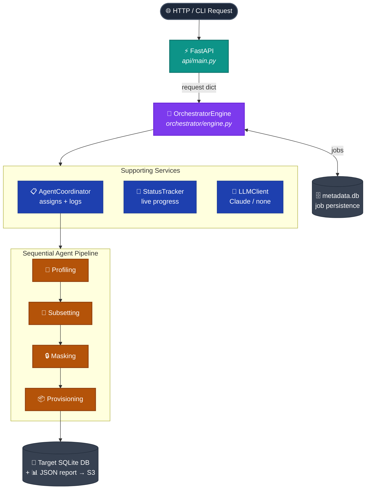
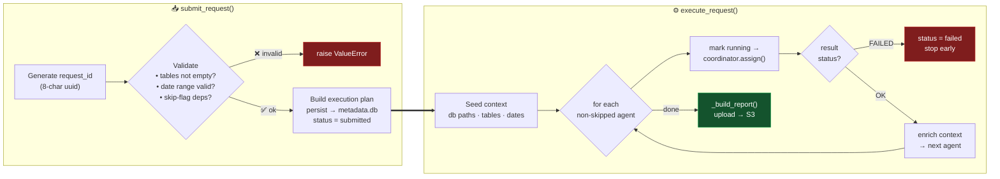
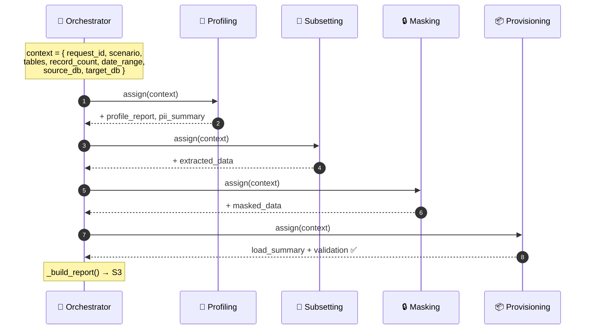
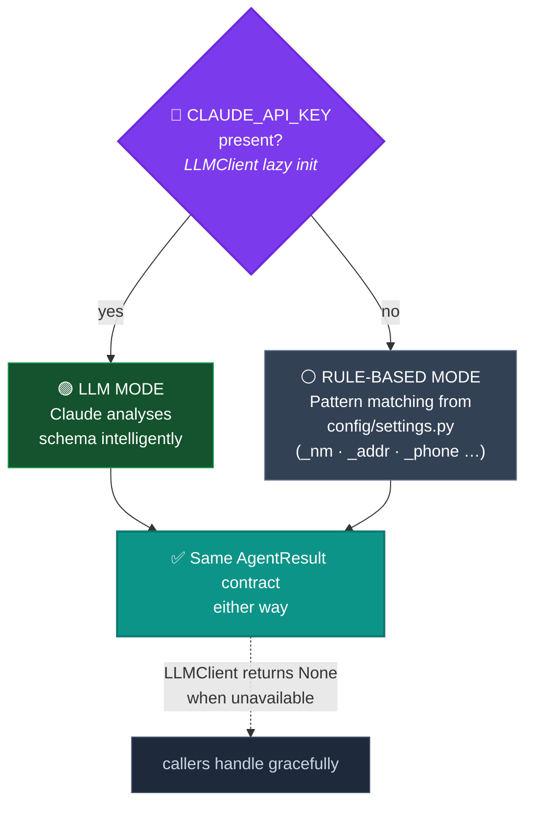
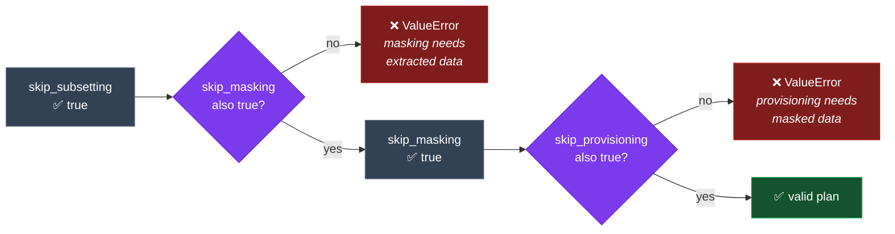
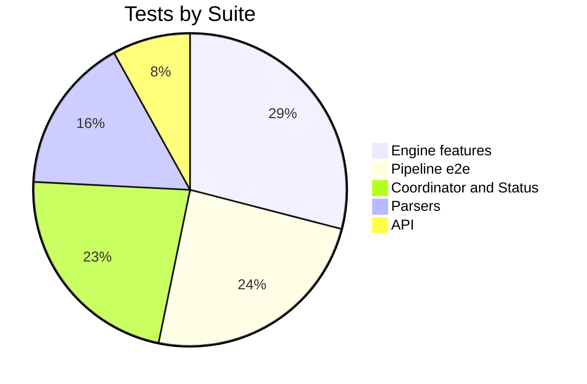

<div align="center">

# 🔀 Shift-Left Test Data Engine

### Workflow & Functionality Guide

*An AI-powered multi-agent system for automated test data provisioning*
**Ab Initio ETL · Teradata Data Warehouse context**

[](#-testing)
[](#-environment)
[-purple?style=flat-square)](#-dual-mode-design)
[](#-rest-api-surface)

</div>

---

## 📖 Table of Contents

| # | Section |
|---|---------|
| 1 | [What It Does](#-what-it-does) |
| 2 | [The Big Picture](#-the-big-picture) |
| 3 | [The 4-Agent Pipeline](#-the-4-agent-pipeline) |
| 4 | [Request Lifecycle](#-request-lifecycle) |
| 5 | [Context Flow Between Agents](#-context-flow-between-agents) |
| 6 | [REST API Surface](#-rest-api-surface) |
| 7 | [Dual-Mode Design](#-dual-mode-design) |
| 8 | [Resilience & Skip Logic](#-resilience--skip-logic) |
| 9 | [Quick Start](#-quick-start) |
| 10 | [Testing](#-testing) |
| 11 | [Project Map](#-project-map) |

---

## ✨ What It Does

The engine takes a plain provisioning request — *"give me 100 referentially-intact rows
for these tables, with all PII anonymized"* — and runs it through **four specialised AI
agents** in sequence. The result: a fully-loaded target database, validated end-to-end,
plus a rich JSON report describing everything that happened.

```
┌────────────────────────────────────────────────────────────────────┐
│  "I need realistic, safe test data for tables X, Y, Z"               │
│                            ⬇                                         │
│   Profile  →  Subset  →  Mask  →  Provision  →  📊 Validated Report  │
└────────────────────────────────────────────────────────────────────┘
```

| Goal | How the engine delivers |
|------|-------------------------|
| 🧠 **Understand the schema** | Parses Ab Initio DMLs + Teradata DDLs, classifies every field |
| 🔒 **Protect sensitive data** | Detects PII and masks it with consistent, type-aware fakes |
| 🔗 **Keep data valid** | Extracts subsets that preserve foreign-key referential integrity |
| 📦 **Deliver safely** | Loads into the target DB transactionally, then validates |
| 🤖 **Work anywhere** | Runs with *or* without a Claude API key (rule-based fallback) |

---

## 🗺 The Big Picture



> **Coordination principle:** Agents **never** call each other directly. The
> `OrchestratorEngine` is the single conductor — it passes a mutable `context` dict
> down the line, and each agent reads what it needs and appends its own output.

---

## 🧩 The 4-Agent Pipeline

All agents inherit from `BaseAgent` and implement `execute(context) → AgentResult`.
The `run()` wrapper adds timing, error capture, and **retry-on-transient-failure**
(connection / timeout / OS I/O errors → up to 3 attempts with linear backoff).

<table>
<tr>
<th width="50">Step</th>
<th>Agent</th>
<th>What it does</th>
<th>Produces</th>
</tr>

<tr>
<td align="center">

### 1️⃣
</td>
<td>

**🧠 Profiling Agent**
</td>
<td>

Parses DML/DDL files. Classifies every field as **PII**, **Control/Audit**,
**SCD-2**, **Key**, or **Business** data. Detects table relationships via naming
conventions (`_id` / `_nbr`). Optionally calls **Claude** for deeper schema analysis.
</td>
<td>

`profile_report`
`pii_summary`
*(saved to `knowledge_base/profiles/`)*
</td>
</tr>

<tr>
<td align="center">

### 2️⃣
</td>
<td>

**🔗 Subsetting Agent**
</td>
<td>

Generates referentially-intact SQL using an **anchor-table strategy** with
`IN`-subquery joins. Validates FK integrity so child rows never dangle.
</td>
<td>

`extracted_data`
*(CSVs → `extracted_data/`)*
</td>
</tr>

<tr>
<td align="center">

### 3️⃣
</td>
<td>

**🔒 Masking Agent**
</td>
<td>

Anonymizes PII with **consistent masking** — the same input always maps to the
same output (hash-keyed cache). Uses **Faker** for type-aware values:
names→`fake.name()`, emails→`fake.email()`, SSNs→`fake.ssn()`, etc.
</td>
<td>

`masked_data`
+ before/after samples
</td>
</tr>

<tr>
<td align="center">

### 4️⃣
</td>
<td>

**📦 Provisioning Agent**
</td>
<td>

Loads masked data into the **target SQLite DB** with transaction safety
(rollback on partial failure). Runs validation: row counts, column existence,
NOT NULL constraints.
</td>
<td>

`load_summary`
`validation` status
</td>
</tr>
</table>

### 🎯 Field Classification Cheat-Sheet

| Class | Detected by | Example columns | Treatment |
|-------|-------------|-----------------|-----------|
| 🔴 **PII** | name/address/phone/id patterns | `cust_nm`, `home_addr`, `phone_nbr` | **Masked** |
| 🟡 **Control** | audit patterns | `load_dt`, `src_sys_cd` | Preserved |
| 🟣 **SCD-2** | `eff_start_dt` / `eff_end_dt` / `logc_del_ind` | versioning columns | Preserved |
| 🔵 **Key** | `_id` / `_nbr` suffixes | `entity_id`, `acct_nbr` | Drives relationships |
| ⚪ **Business** | everything else | `credit_score`, `status` | Passed through |

---

## 🔄 Request Lifecycle



**Status terminal states**

| Status | Meaning |
|--------|---------|
| `completed` | All requested agents succeeded ✅ |
| `partial` | Provisioning didn't fully complete, but pipeline ran ⚠️ |
| `failed` | An upstream agent (profiling/subsetting/masking) failed ❌ |

`submit_request` + `execute_request` can be called separately (async), or together
via the `process_request()` convenience method.

---

## 🔁 Context Flow Between Agents

The `context` dict is the spine of the pipeline. It starts with request metadata and
grows as each agent contributes:



Each agent returns a standardised **`AgentResult`**:

```python
AgentResult(
    agent_name, status,            # PENDING | RUNNING | COMPLETED | FAILED | SKIPPED
    started_at, completed_at, duration_seconds,
    data={...},                    # the agent's payload (merged into context)
    errors=[...], warnings=[...],
    summary="human-readable one-liner",
)
```

---

## 🌐 REST API Surface

Served by **FastAPI** (`api/main.py`). Start with:
`uvicorn api.main:app --reload --port 8000`

| Method | Endpoint | Purpose |
|--------|----------|---------|
| `POST` | `/api/v1/provision` | Submit **and** run the full pipeline (synchronous) |
| `POST` | `/api/v1/provision/async` | Submit, run in background, return receipt immediately |
| `GET`  | `/api/v1/status/{request_id}` | Live status — tries in-memory tracker, falls back to `metadata.db` |
| `GET`  | `/api/v1/results/{request_id}` | Full consolidated report (fetched from S3) |
| `GET`  | `/api/v1/tables` | List available source tables |
| `GET`  | `/api/v1/health` | Health check + active LLM mode |

<details>
<summary><b>📨 Example request</b></summary>

```bash
curl -X POST http://localhost:8000/api/v1/provision \
  -H "Content-Type: application/json" \
  -d '{
    "scenario": "business_entity_flow",
    "tables": ["stg_business_entity", "business_address_match", "business_credit_score"],
    "record_count": 100,
    "date_range": {"start": "2024-01-01", "end": "2024-12-31"}
  }'
```
</details>

---

## 🤖 Dual-Mode Design

The engine is built to degrade gracefully — **no API key required**.



> Pattern rules (PII / control / SCD-2 / relationships) all live in
> **`config/settings.py`** and every path is overridable via env vars.

---

## 🛡 Resilience & Skip Logic

**Retry** — `BaseAgent.run()` retries only **transient** errors
(`ConnectionError`, `TimeoutError`, `OSError`) up to 3× with linear backoff.
Everything else fails fast.

**Skip flags** — any agent can be skipped, but dependencies are enforced at submit time:



| Flag | Allowed alone? | Reason |
|------|:--------------:|--------|
| `skip_profiling` | ✅ | Downstream agents don't hard-require the profile |
| `skip_subsetting` | only with `skip_masking` | Masking consumes extracted data |
| `skip_masking` | only with `skip_provisioning` | Provisioning consumes masked data |
| `skip_provisioning` | ✅ | It's the last step |

---

## 🚀 Quick Start

> 💡 Commands shown for **Windows / PowerShell**.

```powershell
# 1 — Environment
python -m venv venv; venv\Scripts\activate
pip install -r requirements.txt --prefer-binary

# 2 — Initialize the source & target SQLite DBs (seeded with Faker data)
python -m utils.db_setup

# 3 — Run the full pipeline demo end-to-end
python -m orchestrator.demo

# 4 — Or serve the REST API
uvicorn api.main:app --reload --port 8000
```

---

## 🧪 Testing

```powershell
python -m pytest tests/ -v        # all 62 tests
python -m orchestrator.demo       # full pipeline smoke run
```



| File | Tests | Covers |
|------|:-----:|--------|
| `tests/test_pipeline.py` | 15 | End-to-end pipeline, individual agents, validation, edge cases |
| `tests/test_api.py` | 5 | Health, list tables, provision, 404 handling |
| `tests/test_parsers.py` | 10 | DML/DDL parsing, field extraction, empty input |
| `tests/test_engine_features.py` | 18 | Retry, skip flags, persistence, enterprise mode, RemoteExecutor, Bedrock fallback |
| `tests/test_coordinator_status.py` | 14 | Coordinator assignment/progress/reset, StatusTracker lifecycle |

> 🔄 **CI:** GitHub Actions runs the full suite on every push / PR to `main`
> (`.github/workflows/test.yml`).

---

## 🗂 Project Map

```
shift-left-test-engine/
├── api/
│   └── main.py              # FastAPI REST layer (lifespan startup, endpoints)
├── orchestrator/
│   ├── engine.py            # 🎯 Core conductor: validate → plan → run → report
│   ├── coordinator.py       # Assigns tasks to agents, logs progress
│   ├── status.py            # In-memory live status tracker
│   └── demo.py              # End-to-end demo scenario
├── agents/
│   ├── base_agent.py        # Abstract base: AgentResult + run() w/ retry
│   ├── profiling_agent.py   # 1️⃣ Schema analysis + PII detection
│   ├── subsetting_agent.py  # 2️⃣ Referentially-intact extraction
│   ├── masking_agent.py     # 3️⃣ Consistent PII anonymization (Faker)
│   └── provisioning_agent.py# 4️⃣ Transactional load + validation
├── parsers/
│   ├── dml_parser.py        # Ab Initio DML format parser
│   └── ddl_parser.py        # Teradata DDL parser
├── config/
│   └── settings.py          # Patterns (PII/control/SCD-2/rel) + paths (env-overridable)
├── utils/
│   ├── llm_client.py        # Singleton Claude client (lazy, graceful degradation)
│   ├── db_setup.py          # Builds SQLite schema, seeds Faker data
│   ├── database.py          # SQLAlchemy engines / sessions
│   ├── storage_client.py    # S3 report upload/download
│   └── remote_executor.py   # Enterprise remote execution
├── mock_data/               # Sample DML / DDL / CSV inputs
├── knowledge_base/profiles/ # Saved profile reports (JSON)
└── tests/                   # 62 tests across 5 files
```

---

<div align="center">

### 🔀 Profile → Subset → Mask → Provision

*Safe, valid, realistic test data — shifted left.*

<sub>Workflow documentation authored by Claude.</sub>

</div>
